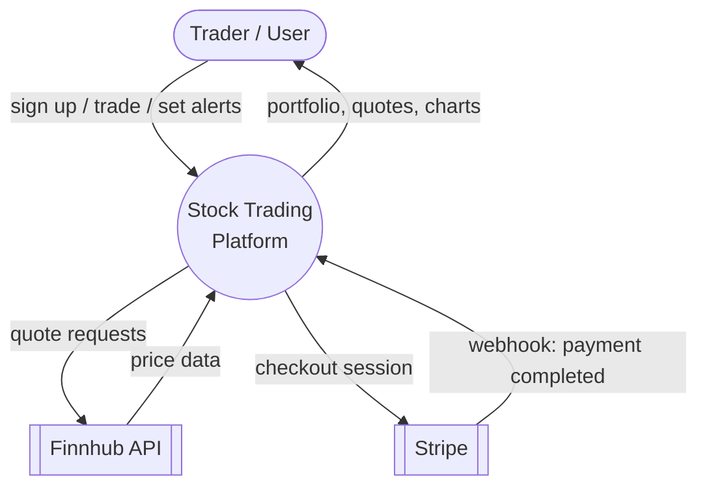
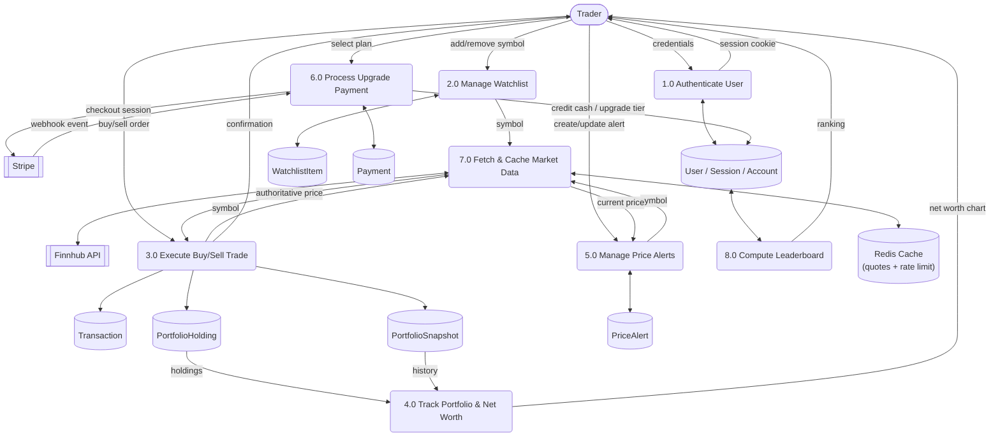
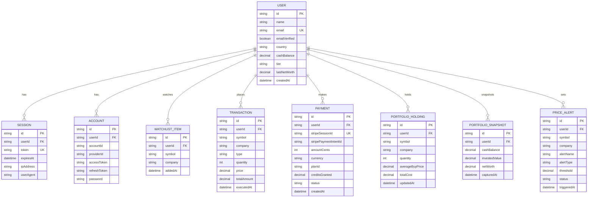

# Stock Trading Platform

A full-stack paper-trading web app built with Next.js 15. Trade real stocks with virtual cash, track your portfolio, and compete on a leaderboard — all backed by live market data.

## Features

- **Buy/sell trading** — Serializable-isolation database transactions guarantee correct cash and holding balances even under concurrent trades (no double-spends, no lost updates). See `scripts/test-concurrent-trading.ts` for a load test that verifies this.
- **Portfolio tracking** — average-cost-basis holdings, transaction history, and per-trade portfolio snapshots that power a net-worth history chart.
- **Live market data** — real-time quotes and TradingView charting widgets via the Finnhub API, cached and rate-limited through Redis so bursts of traffic can't exceed Finnhub's API limits.
- **Watchlist** — track symbols you're interested in without holding a position.
- **Price alerts** — set upper/lower price thresholds per symbol and get notified when they're crossed.
- **Leaderboard** — global ranking by net worth.
- **Paid upgrades** — Stripe Checkout flow that credits virtual trading cash and upgrades your account tier, processed through signature-verified, idempotent webhooks.
- **Authentication** — session-based auth via Better Auth, with route protection enforced in middleware.

## Tech Stack

- **Framework:** Next.js 15 (App Router), React 19, TypeScript
- **Database:** MySQL with Prisma ORM
- **Auth:** Better Auth
- **Payments:** Stripe
- **Caching / Rate Limiting:** Upstash Redis
- **Market Data:** Finnhub API, TradingView widgets
- **Styling:** Tailwind CSS

## Architecture — Data Flow Diagram

**Context Diagram (Level 0)**



**Level 1 — Major Processes**



## Database Schema — ER Diagram



Notes:
- `WATCHLIST_ITEM` and `PORTFOLIO_HOLDING` each enforce a unique `(userId, symbol)` pair — one row per symbol per user.
- `PAYMENT.stripeSessionId` is unique, letting the Stripe webhook handler safely ignore duplicate delivery of the same event.
- `PORTFOLIO_SNAPSHOT` rows are append-only, written inside the same transaction as a buy/sell, and drive both the net-worth chart and (via `USER.lastNetWorth`) the leaderboard.

## Getting Started

### Prerequisites

- Node.js 20+
- A MySQL database
- API keys for [Finnhub](https://finnhub.io/), [Upstash Redis](https://upstash.com), and [Stripe](https://dashboard.stripe.com/apikeys) (Stripe is only required for the upgrade/payment flow)

### Setup

1. Install dependencies:
   ```bash
   npm install
   ```

2. Copy the environment template and fill in your values:
   ```bash
   cp .env.example .env
   ```

3. Run database migrations:
   ```bash
   npm run db:migrate
   ```

4. Start the dev server:
   ```bash
   npm run dev
   ```

The app will be available at `http://localhost:3000`.

### Scripts

| Command | Description |
| --- | --- |
| `npm run dev` | Start the dev server (Turbopack) |
| `npm run build` | Production build |
| `npm run start` | Start the production server |
| `npm run lint` | Lint the codebase |
| `npm run db:migrate` | Apply Prisma migrations |
| `npm run db:studio` | Open Prisma Studio |
| `npm run db:push` | Push schema changes without a migration |
| `npm run db:test` | Verify the MySQL connection |
| `npm run db:test:concurrency` | Run the concurrent buy/sell regression test |

## Project Structure

```
app/(root)/       Authenticated pages: portfolio, watchlist, markets, orders, wallet, leaderboard, upgrade
app/api/          Route handlers (e.g. Stripe webhooks)
components/       UI components
hooks/            Client-side hooks (e.g. live polling)
lib/actions/      Server actions (trading, portfolio, alerts, leaderboard, payments, watchlist)
lib/auth/         Session helpers
lib/better-auth/  Better Auth configuration
lib/redis/        Redis client + rate limiter
lib/stripe/       Stripe client + plan definitions
prisma/           Schema and migrations
scripts/          Standalone DB and regression-test scripts
```
